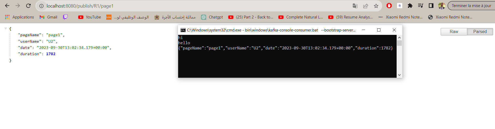

<H1  style="text-align:center"> Kafka : </H1>
<H3>- Kafka Console Consumer And Kafka Console Producer</H3>

<H3>- Kafka Producer  </H3>

<H3>- Kafka Consumer</H3>

<H3>- Test Of Kafka Supplier</H3>

<H3>- Test Of Kafka Function  </H3>

<H3>- Test Of Kafka Streams  </H3>

<H3>- processing Of The Data Using Kafka Stream </H3>
